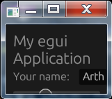
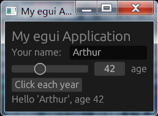

# 案例分析

注意：这里所谈到的例子在 2022 年之前发布的版本中（0.16.1 及其之前）可能不同，也不保证在将来的版本中不变。

## download_image

> src: [eframe/examples/download_image][download_image]

[download_image]: https://github.com/emilk/egui/blob/master/eframe/examples/download_image.rs

关键点：
1. 异步获取数据
2. 解析和展示图片（展示图片需要特定的二进制数据）[^image.rs]：`load_texture`、`ColorImage`
3. 等待请求时显示 Spinner
4. 涉及 `ehttp`、`poll_promise`、`image` crates 的综合案例

[^image.rs]: 这部分与 
[eframe/examples/image.rs](https://github.com/emilk/egui/blob/master/eframe/examples/image.rs) 展示的内容基本一致

## file_dialog

> src: [eframe/examples/file_dialog](https://github.com/emilk/egui/blob/master/eframe/examples/file_dialog.rs)

关键点：
1. 文件导入与拖拽：`hovered_files`、`dropped_files`
2. 在最顶层图层绘制屏幕居中的文件名：`layer_painter`
3. 基础的交互模式和横向布局（默认是纵向排布）
4. [`rfd`](https://docs.rs/rfd) crate 跨平台原生文件导入对话框（支持 WASM）


# 技巧整理

1. [egui#code-snippets](https://docs.rs/egui/latest/egui/index.html#code-snippets)
    - 移除 widgets 之间的空隙：`ui.spacing_mut().item_spacing.x = 0.0`
    - 横向布局：`ui.horizontal*`
    - 可见分组：`ui.group`
    - 隐藏分组：`ui.scope`
2. 设置窗口大小必须至少容纳所使用的大小：`frame.set_window_size(ctx.used_size())`
    - 未设置的话会，当窗口尺寸缩小到小于所使用的大小时，会出现\
      
    - 设置的话，不改变现有窗口大小，只是窗口最小只能缩小成\
      
    - src: [eframe/examples/hello_world](https://github.com/emilk/egui/blob/master/eframe/examples/hello_world.rs)
3. 设置自定义字体（只支持 ttf/otf ）：
    - 见 [eframe/examples/custom_font](https://github.com/emilk/egui/blob/master/eframe/examples/custom_font.rs)
    - 见 [egui: How to use system installed fonts just like Windows?](https://github.com/emilk/egui/discussions/1173)
    - 以下是基于 `custom_font.rs` 做的一些关于文件大小测试（在 Win7 下使用本地 20.7Mb 的微软雅黑字体，仅供参考）

    ```rust,ignore
    // 嵌入二进制
    const FONT: &[u8] = include_bytes!(r#"C:\Windows\Fonts\msyh.ttf"#);
    fonts.font_data.insert("my_font".to_owned(), egui::FontData::from_static(FONT));

    // 动态加载
    const FONT_LOC: &str = r#"C:\Windows\Fonts\msyh.ttf"#;
    let font = std::fs::read(FONT_LOC).expect("未找到字体文件");
    fonts.font_data.insert("my_font".to_owned(), egui::FontData::from_owned(font));
    ```

| 说明       | mode    | profile                     | size (Mb) |
|------------|---------|-----------------------------|-----------|
| 嵌入二进制 | debug   | default                     | 24.6      |
| 动态加载   | debug   | default                     | 3.86      |
| 嵌入二进制 | release | default                     | 21.9      |
| 动态加载   | release | default                     | 1.23      |
| 嵌入二进制 | release | opt-level = 3; lto = true   | 21.8      |
| 动态加载   | release | opt-level = 3; lto = true   | 1.1       |
| 嵌入二进制 | release | opt-level = "s"; lto = true | 21.6      |
| 动态加载   | release | opt-level = "s"; lto = true | 0.91      |

