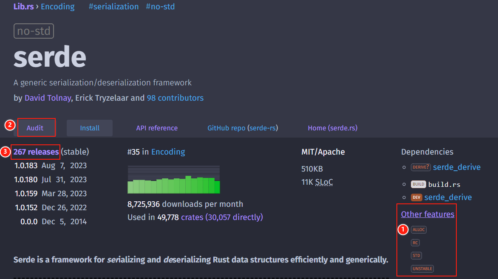
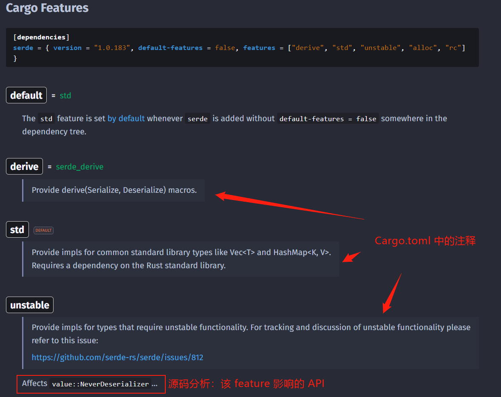
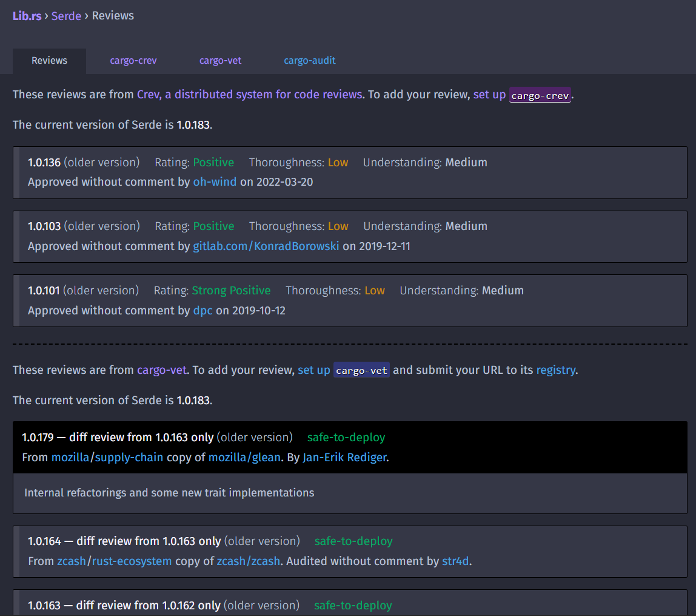
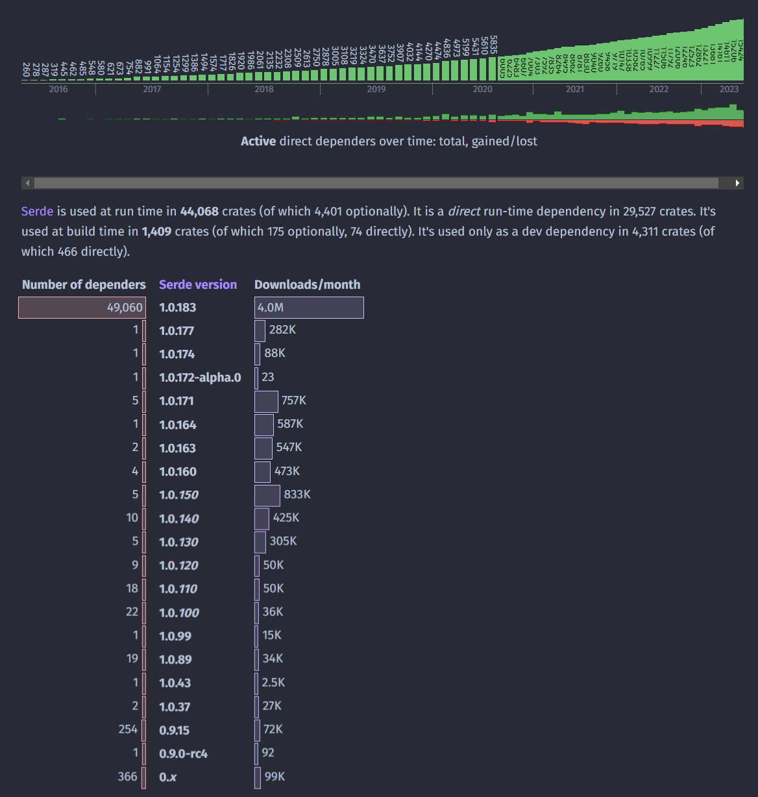

# [lib.rs] 网站新功能一览

> src: 2023.08.17 [New features on lib.rs](https://users.rust-lang.org/t/new-features-on-lib-rs/98560)

[lib.rs]: https://lib.rs/



# 1. 新的 feature 页面

通过解析以下内容
1. `Cargo.toml` 中 feature 名上方的注释（以 markdown 方式)
2. 源代码中 `cfg(feature = "…")` 的 API （以短路径方式）

罗列、展示并分类 features。例如对于以下内容

```toml
[features]
default = ["std"]

# Provide derive(Serialize, Deserialize) macros.

derive = ["serde_derive"]

# Provide impls for common standard library types like Vec<T> and HashMap<K, V>.
# Requires a dependency on the Rust standard library.
std = []

# Provide impls for types that require unstable functionality. For tracking and
# discussion of unstable functionality please refer to this issue:
#
#    https://github.com/serde-rs/serde/issues/812
unstable = []
```

```rust
#[cfg(feature = "unstable")]
pub struct NeverDeserializer<E> {
    never: !,
    marker: PhantomData<E>,
}
```

得到的 feature 页面



一些实际例子：
* <https://lib.rs/crates/serde/features>
* <https://lib.rs/crates/quick-xml/features>
* <https://lib.rs/crates/serde_with/features>

# 2. 新的审计页面

该页面集成以下审计来源：
* 【新增】[cargo-vet](https://github.com/mozilla/cargo-vet)：来自 Google、Mozilla、未修复的 rustsec 公告
* [cargo-crev](https://github.com/crev-dev/cargo-crev)：与语言和生态系统无关的分布式、加密验证的代码审查系统



例如：
* <https://lib.rs/crates/serde/audit>
* <https://lib.rs/crates/failure/audit>

# 3. 精简反向依赖图

对于很多版本的库，对下载量少的版本进行合并，避免图形很长。



# 其他更新

* 新的维护状态标签
* 部分修复 github 账号重命名之后的仓库链接失效问题
* 更准确的仓库链接
* markdown 渲染问题：修复 ``[`crate::ident`]`` 、自动检测
* 添加改进的关键字：猜测类别
* 处理同一依赖的多版本问题（使用了 package 别名）
* 更频繁更新信息：从原来的 1 小时更新频率改为 15 分钟
* 更新 [免责声明](https://lib.rs/data-processing)
