# 我的 RustChinaConf 2025 记录

## 前言

当我刚开始学习 Rust 的时候，正值 Rust 中国大会第一届那年，也就是 2020 年。

今年有幸作为演讲者首次参加大会，正值 Rust 语言 10 周年。关于 [我与 Rust 语言的 5 年](./five-years-with-rust.md)，已不再赘述。

在这篇文章里，我将回顾参加杭州 Rust 大会的一些体验和感受。官方图片见[此处](https://www.xxpie.com/m/album?id=68bed1c5eb20ce1b2537b237)，
宣传贴见[此处](https://rustcc.cn/article?id=3fc1cbea-3010-4d08-88e4-13e08d7d0f69)。

非常感谢这次学习和交流的机会，以及主办方 RustChinaConf 和 GOSIM。

## 9.12 - 晚宴

晚上 7 点至 9 点的接风宴位于“宫宴”，沉浸式的表演让人目不暇接，美食也相当可口。

  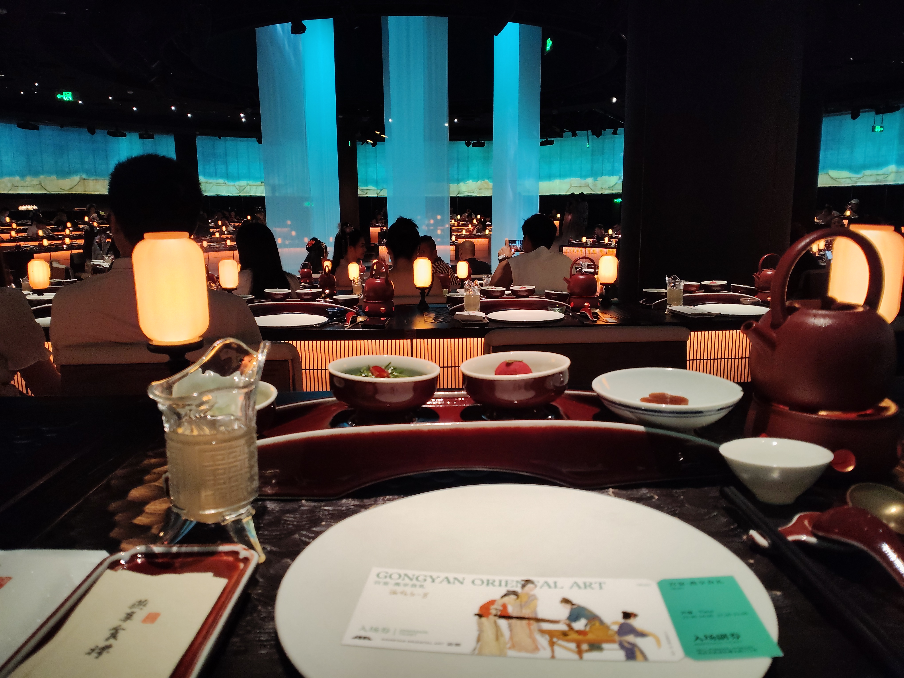
  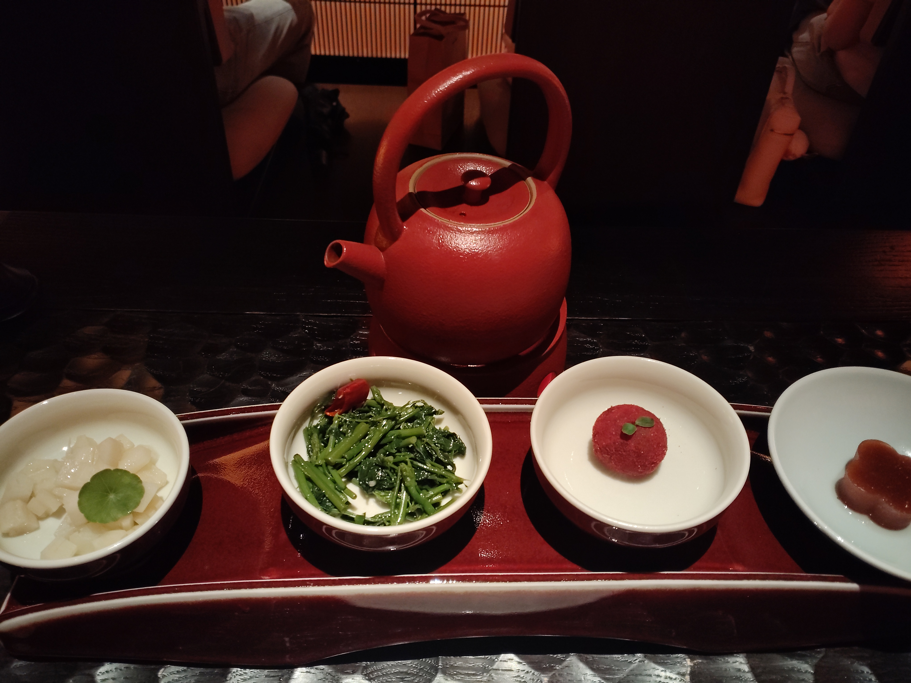
  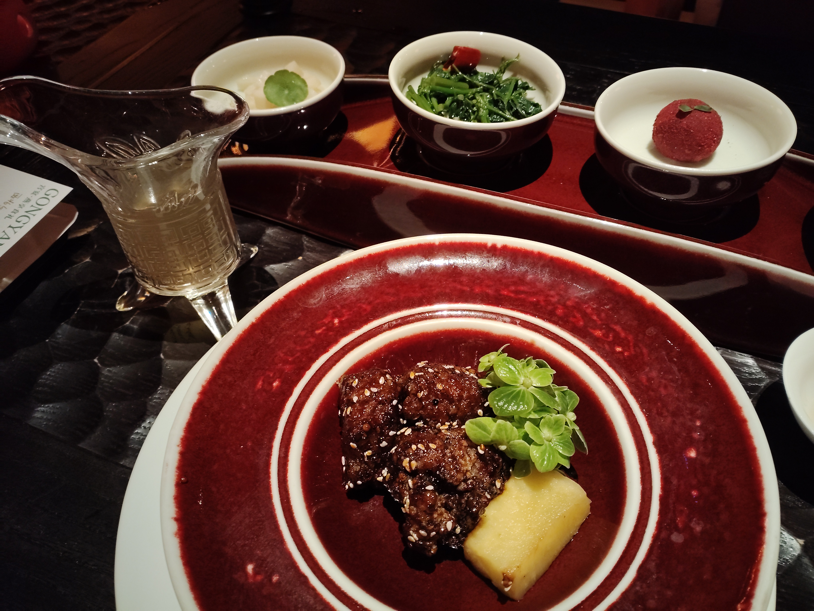
  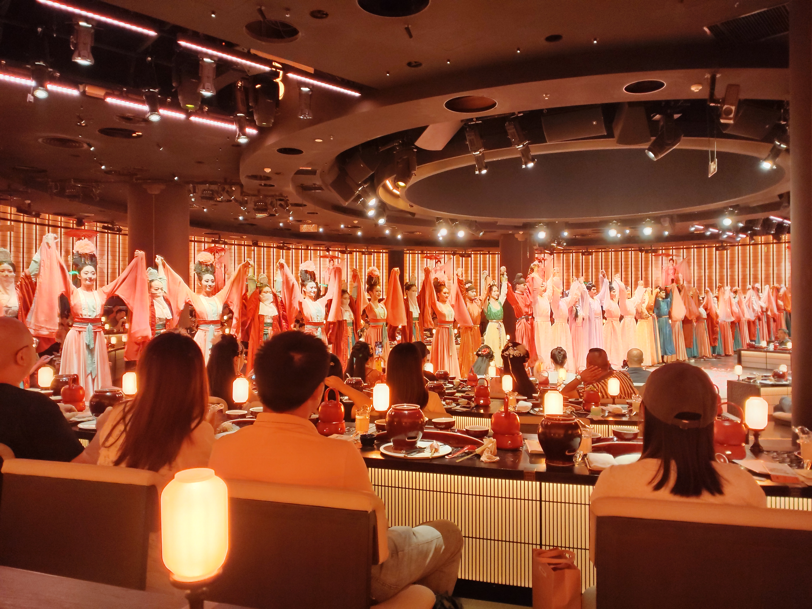

离开时，Rust 大会组织者和演讲者临时在幽暗的灯光下拍了一些合照。（以下照片我调整了亮度并进行了裁剪。）

没想到又在田洪亮博士旁边留影，而且后来我才知道尤予阳博士就在旁边。

这也是为数不多的中外演讲者同框的照片。

  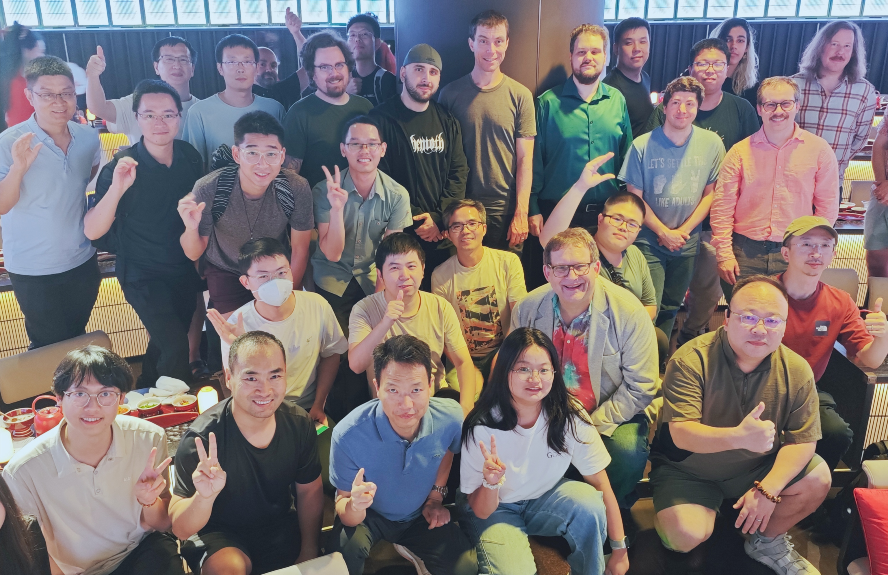
  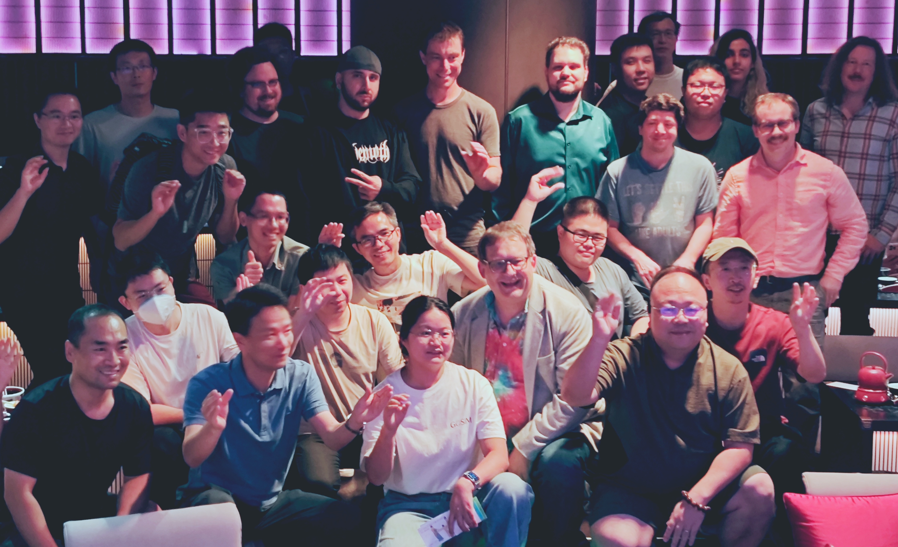

期间也有一些小插曲，比如出发时间几番提前、临近集合才告知晚宴地点等等。

在出发和返回的路上，我认识了 Zino 框架作者潘赞大哥和南京大学的吴家焱同学，一路聊了很多琐事。

## 9.13 - 上午 - 开幕式与闭门会议

9 点半到 10 点听 GOSIM 的开幕演讲。原来 GOSIM 是 CSDN 创始人蒋涛发起的。

  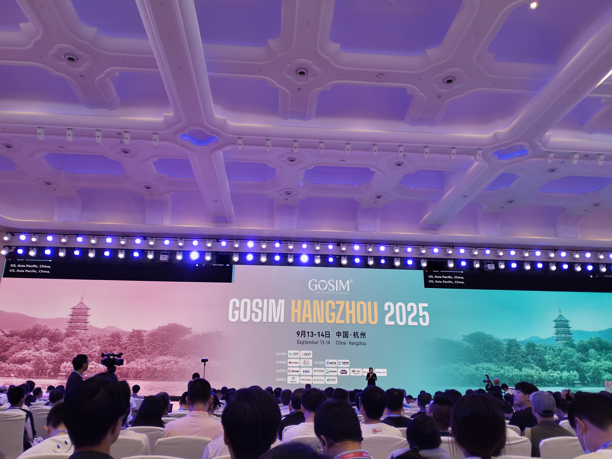
  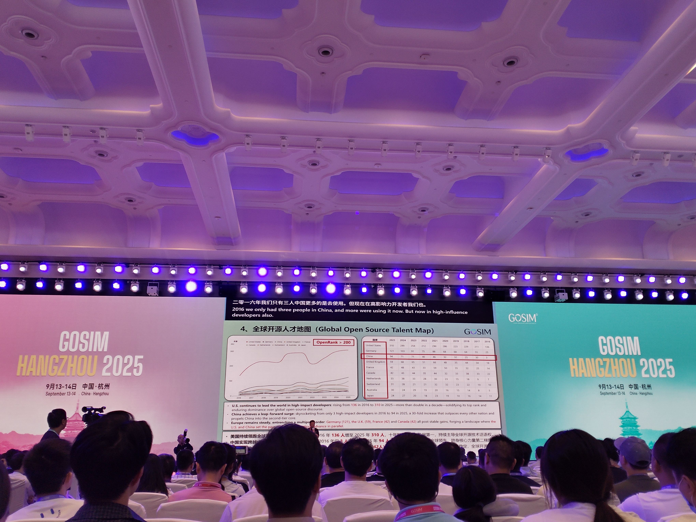

10 点转至 Rust 会场，听完 Rust 基金会执行董事 Rebecca 的开幕演讲，就参加了与 Rust 基金会的闭门会议。

闭门会议是冯老师主持的，与 Rust 基金会人员面对面交流，涉及 Rust 项目、行业、教育等话题。

  
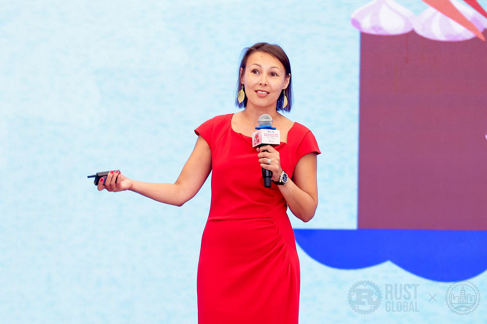 
Rebecca 开幕演讲

  
 
与 Rust 基金会的闭门会议 1

  
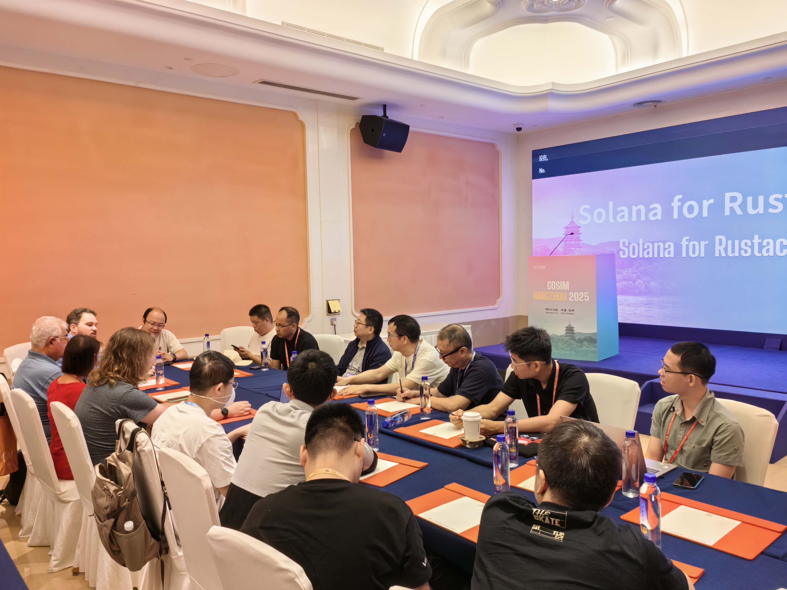 
与 Rust 基金会的闭门会议 2 

这里的插曲是，我被张老师提前 1 天告知要参加这个，他和徐老师都希望我谈谈我的工作。于是我准备了一点 
PPT 和英文演讲，但最终我只是用英文介绍了自己，就没再说话了。

这是我第一次面对面听外国人说英文，以前只通过音频或者视频来听到英文。因此听大家用英文交流，我也学习了很多。

Rebecca 会在说话的时候，眼神落在每个人身上，即便他们除了介绍自己没有说太多的话 —— 这让我印象很深。

基金会谈论的东西大部分我都比较清楚；我平常还知道这些外国演讲者在 Rust 项目或者生态中的工作，甚至之前看过他们之中一些人的演讲视频。

## 9.13 - 下午 - 观看演讲和交流

下午主要听分会场演讲，并与一些前辈面对面交流。

* 田博士介绍了星绽操作系统的独特之处，以及星绽发表在顶级期刊论文中的工作
* Bart 教授基于介绍了使用 Rust 对 Microbit 在声音方面的应用
* 在场外我与郑友捷、尤予阳聊了一会，然后田博士加入了对话
  * 田博士问我星绽的安全属性进展如何，我说还没有什么进展；不过这周五星绽社区周会上，崔晨昊提出了一些标注问题，并争取下周在星绽周会上正式分享进度
  * 有个人一直在旁边听我们聊，大家散了之后我问他有什么事吗，他说他们有一个商业的形式化验证（也是第二日主题演讲“工业级验证”）产品正在验证星绽，
    我在微信上告诉了田博士，但貌似田博士知道这个事
* 观看了 Rust Global 的圆桌讨论，主要是基金会和外国讲师之间相互交流
  * 最后的提问环节，我提了一个问题，关于最近 Michael、Nicholas 等 Rust 项目核心人员不再全职从事 Rust 项目开发的影响。这可能是一个沉重的话题，但 
    Rebecca 站在基金会的角度表达了一些很好的观点（尤其情况在资金允许的情况下聘用人员），然后台上其他嘉宾也分享了自己的看法。

  
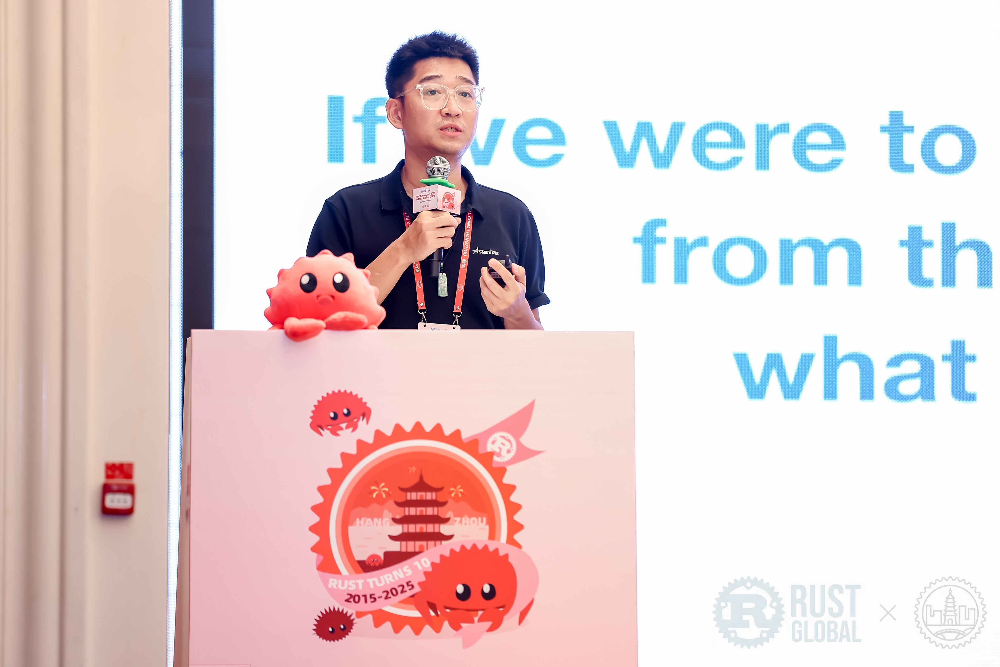 
田洪亮博士演讲 Asterinas

  
 
Bart Massey 副教授演讲 Rust 嵌入式

  
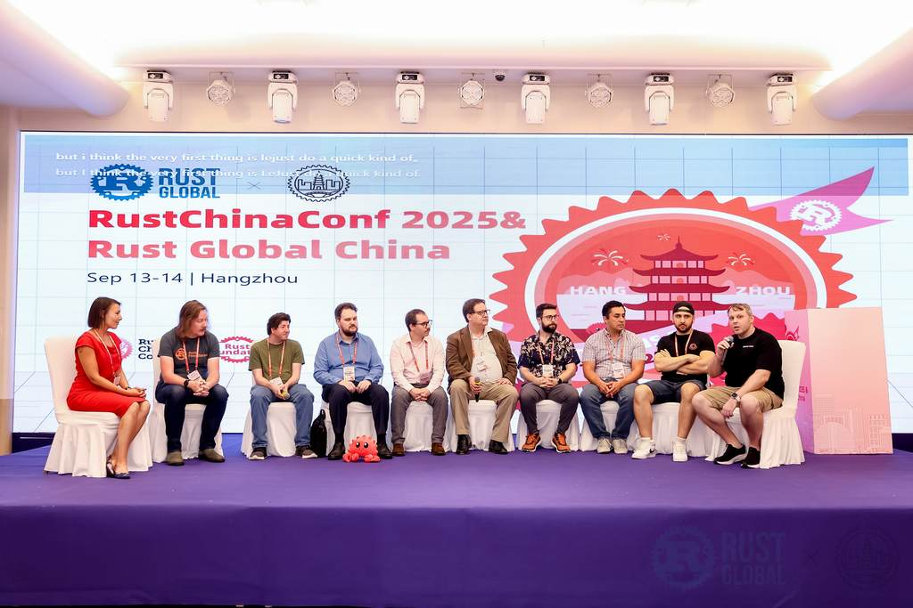 
 Rust Global 圆桌讨论 - 基金会与国际讲师交流

## 9.13 - 夜游

GOSIM 组织了所有讲师在钱塘江上进行游轮夜游。但可惜出门就遭遇大雨，游轮顶部的露台餐桌就无法使用，大家只能在船舱内聚餐和交流。从晚上
6 点到 9 点，游轮在江上缓慢地行驶，穿过了几座桥。大概最后 1 小时，雨停了，于是登上船顶吹凉爽的江风，欣赏两岸的都市夜色。

  
  
  

## 9.14 - 上午 - 观看主题演讲

第二日早上与徐老师约好在酒店吃早餐，当我拿着盘子找房间的时候，他已经和俞老师在交谈了。

上午观看了所有主题演讲，中午结束的时候大家拍了大合照。但有些遗憾没有和陈老师他们一起合影。

  
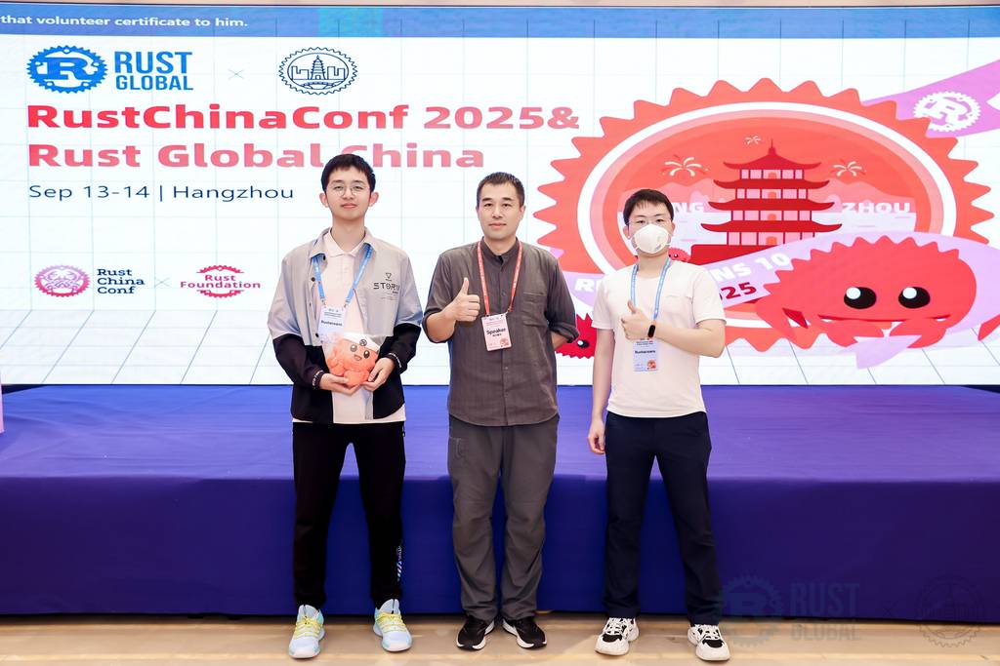 
陈渝老师、尤予阳、郑友捷

  
 
第二日主题演讲列表

  
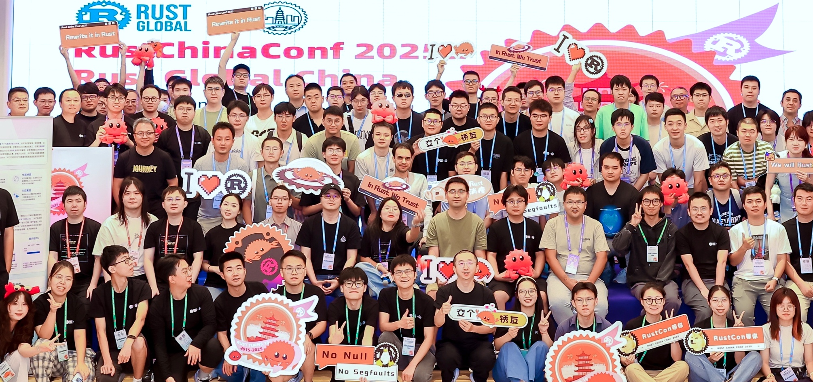 
 第二日会场大合照

  
 
 第一日会场大合照

  
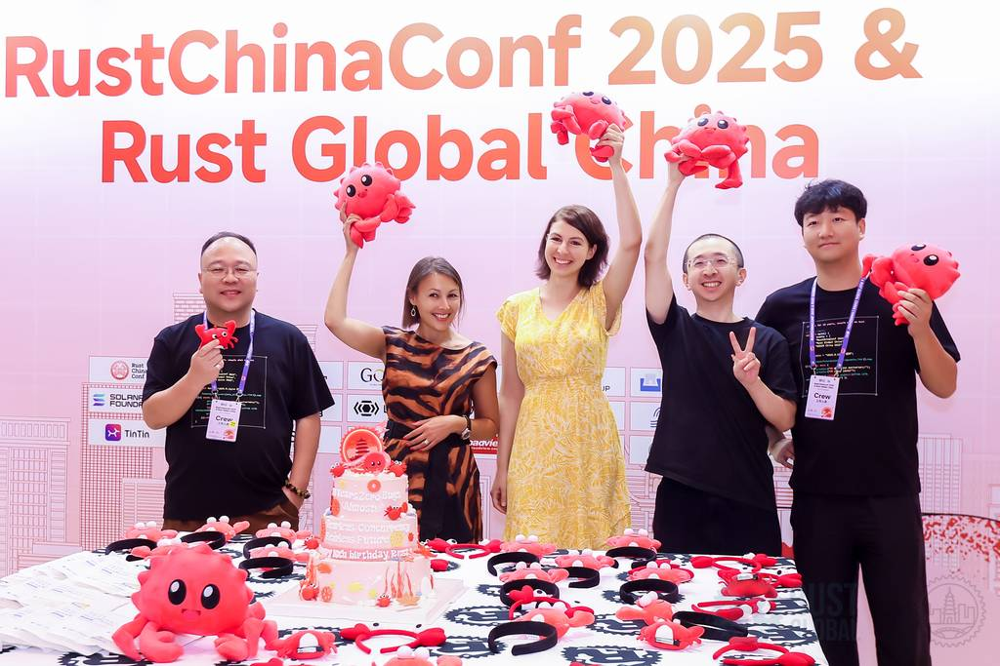 
Rust 10 周年庆祝

## 9.14 - 下午 - 主持和演讲

下午我在分会场担任了主持工作，这是我第一次主持。没有串讲词，但通过查看一个讲师和讲题的基本信息文件来做各个演讲的引子。
作为主持人，我还需要根据定时剩下的时间来询问观众是否需要提问。

我的演讲在最后一个，剩下可能 30 人不到在场。顺利地讲完内容，但在结尾致谢的时候，我的情绪上来了。这一次不再有人解围，我背过身调整了一会儿，
台下响起掌声，我在哽咽的感谢中逐渐恢复回来，并走下台回答听众的提问。或许有些状况发生，但我很高兴完成了演讲。

我离开前，志愿者把一只 Ferris 吉祥物布偶送了给我，非常感谢大家的包容和关心！

  
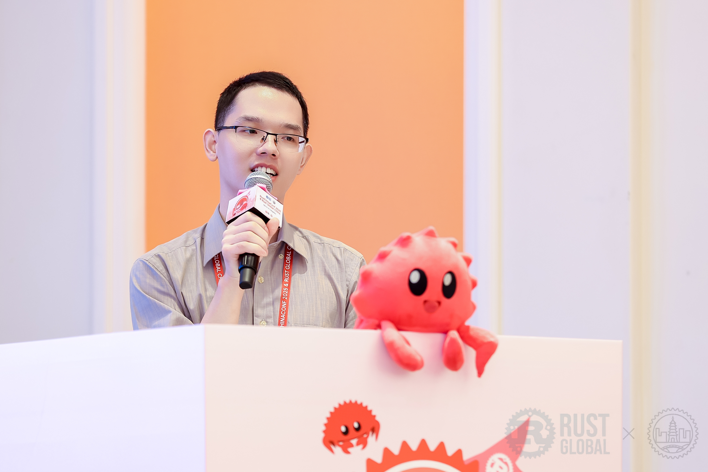 
分会场主持和演讲 os-checker

  
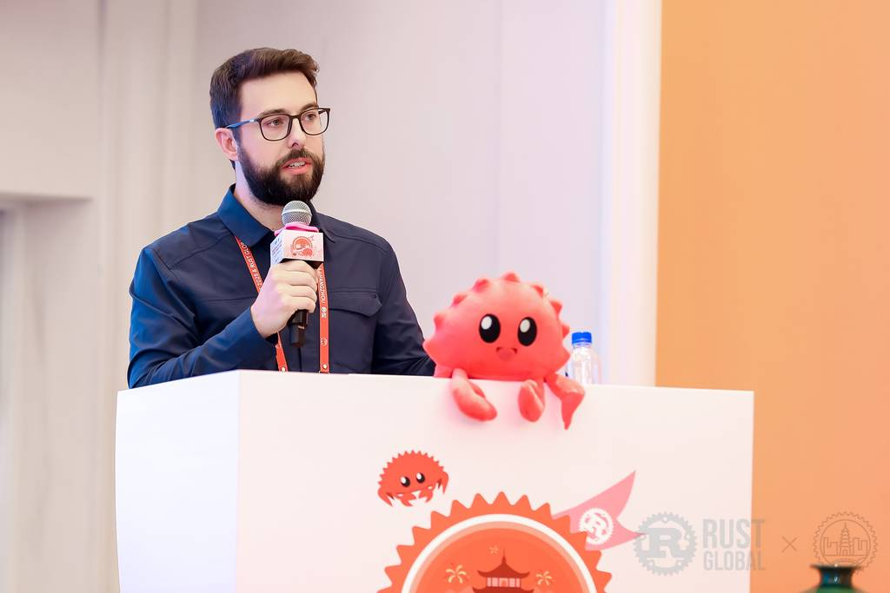 
Kevin Boos 《Robrix》

  
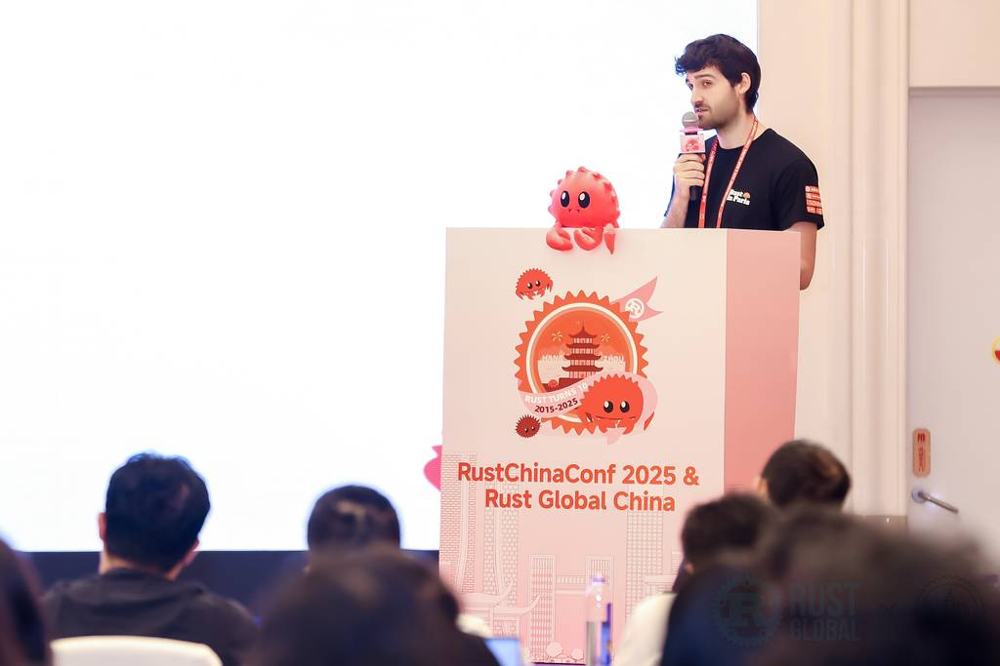 
Guillaume Gomez 《How Doctests Work》

  
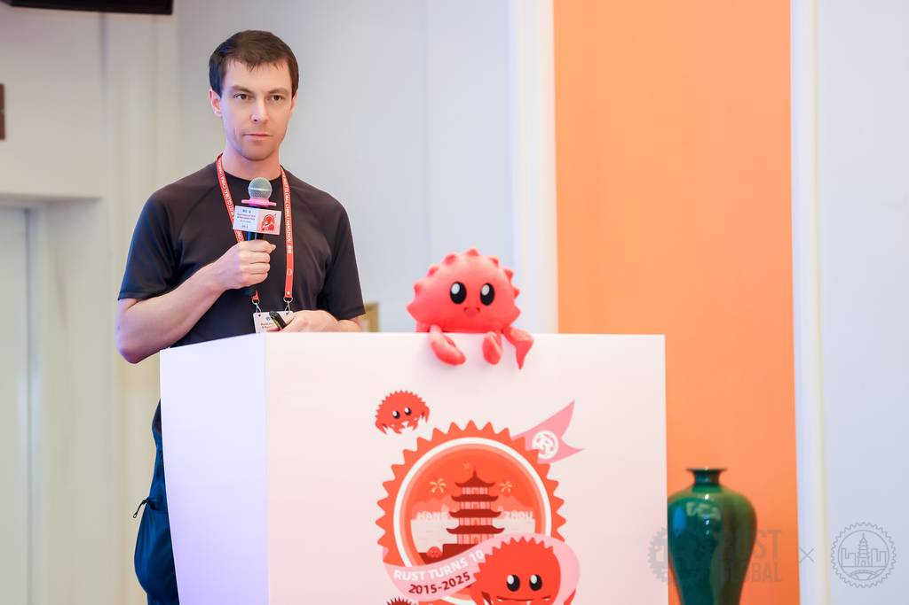 
David Lattimore 《Creation of an executable》

  
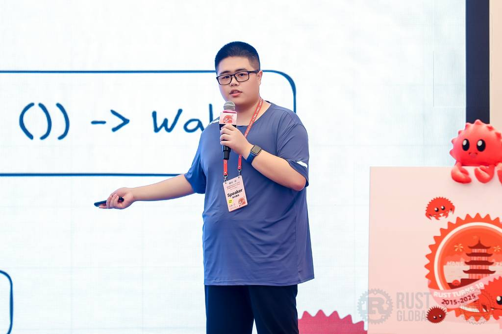 
张奇祺 解读 #[tokio::main] 

  
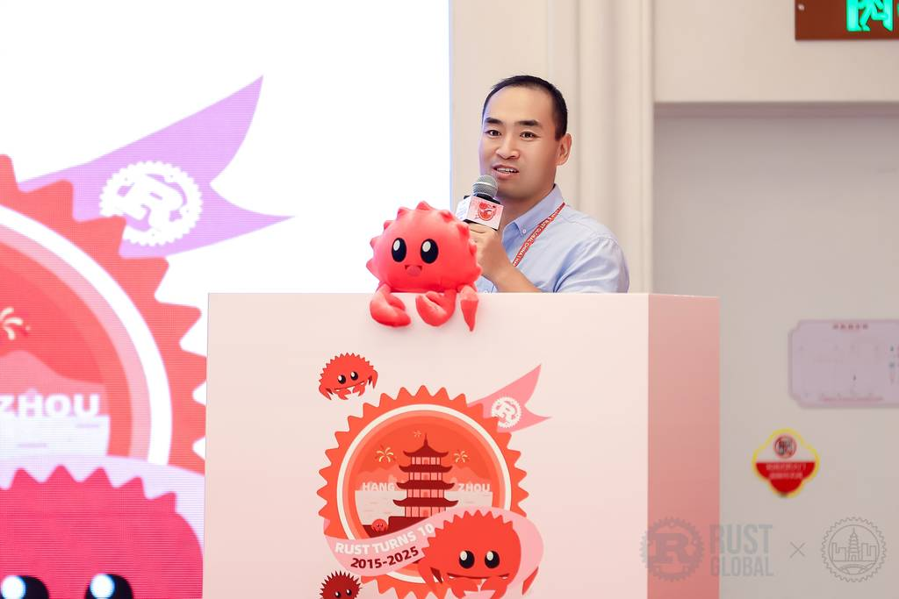 
黄旭东 《双向并发链表实现》

  
 
演讲列表

## 总结

收获了一些礼物

  
  

但更重要的是，收获了这段难忘的经历和旅程。感谢相遇！
